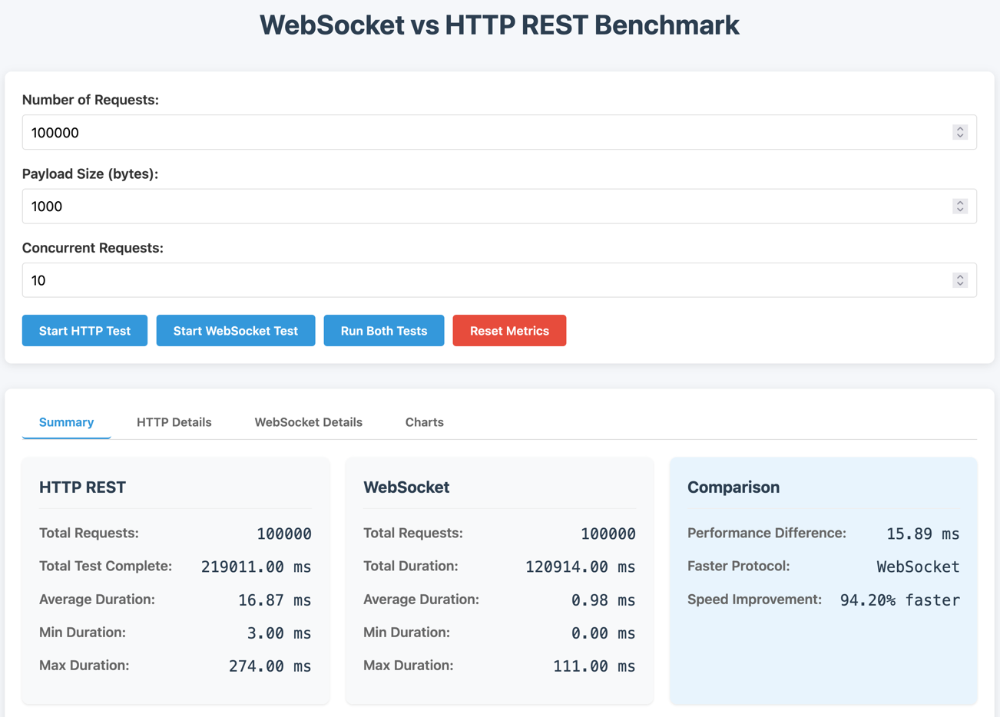
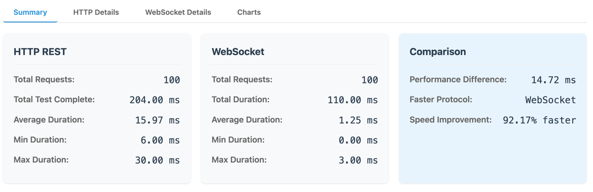
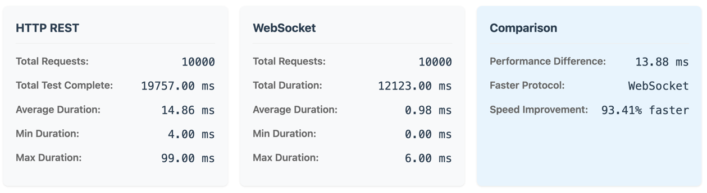
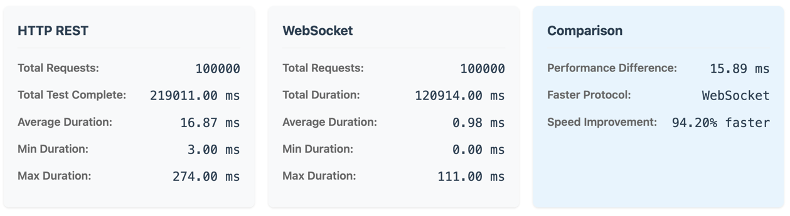

# WebSocket vs HTTP Benchmark

This project provides a comprehensive benchmarking tool to compare the performance of WebSocket and HTTP REST protocols in real-time applications.



## Overview

The benchmark measures and compares the latency and throughput characteristics of WebSocket and HTTP connections, helping developers make informed decisions about which protocol is more suitable for their specific use cases.

## Features

- **Dual Protocol Testing**: Test both WebSocket and HTTP REST endpoints with the same payload and conditions
- **Configurable Parameters**: Adjust request count, payload size, and concurrency levels
- **Detailed Metrics**: View comprehensive timing data including:
  - Average request duration
  - Minimum and maximum latencies 
  - Total test completion time
  - Individual request timings
- **Visual Comparison**: Interactive charts to visualize performance differences
- **High Precision Timing**: Microsecond-level precision for accurate measurements

## Project Structure

- **`/backend`**: Node.js server implementing both WebSocket and HTTP endpoints
  - `server.js`: Express server with WebSocket support

- **`/frontend`**: Browser-based UI for running tests and viewing results
  - `index.html`: Main HTML interface
  - `app.js`: JavaScript code for the benchmark UI and test logic

## How to Use

1. Clone the repository:
   ```
   git clone https://github.com/codegik/websocket-benchmark.git
   cd websocket-benchmark
   ```
2. Start the backend server and frontend:
   ```
   ./start.sh
   ```

3. Open your browser and navigate to:
   ```
   http://localhost:4000
   ```
4. Run your tests by the UI.

5. Stop the server when done:
   ```
   ./stop.sh
   ```

## Interpreting Results

The benchmark provides several metrics to compare the protocols:

- **Average Duration**: The mean time taken for request/response roundtrips
- **Total Test Complete**: The total time taken to complete all test requests
- **Performance Difference**: The absolute time difference between protocols
- **Speed Improvement**: Percentage improvement of the faster protocol

In most scenarios, WebSockets will show better performance for frequent small message exchanges due to reduced overhead, while HTTP may be more suitable for less frequent, larger data transfers.

## Technical Details

- The backend implements an echo server for both protocols
- Timing is measured with microsecond precision using `performance.now()`
- Tests can be configured to simulate different real-world scenarios
- Results can be reset to run multiple test configurations

# Results
The results of the benchmark will vary based on network conditions, server load, and client capabilities. Generally, you can expect:

All the payload sizes are 1000 bytes.

## 1k Requests with 10 Concurrency


## 10k Requests with 10 Concurrency


## 100k Requests with 10 Concurrency
